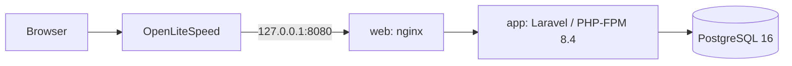
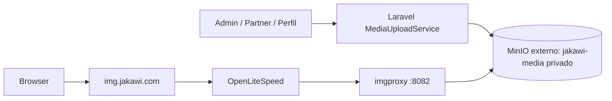

# Arquitectura actual

JAKAWI es un monolito Laravel 13 con frontend React/TypeScript servido mediante Inertia. La aplicación corre en PHP 8.4 dentro de Docker; el PHP 8.1 del host no es un runtime ni una herramienta válida para Laravel, Composer o tests.

## Contenedores y borde

`compose.yaml` define `web`, `app`, `db` e `imgproxy`. `web` publica solamente `127.0.0.1:8080:80`; OpenLiteSpeed maneja el HTTPS público de `jakawi.com` y hace proxy a ese puerto. `imgproxy` publica `127.0.0.1:8082:8080`; `img.jakawi.com` llega a él mediante OpenLiteSpeed. PostgreSQL no publica un puerto de host. Los datos de producción usan el volumen `jakawi_postgres_data` (con el proyecto Compose por defecto, normalmente `jakawicom_jakawi_postgres_data`).

El build Docker compila Vite una vez y copia el resultado tanto a la imagen `app` como a `web`. Por ello, cualquier cambio de frontend exige reconstruir/recrear ambos servicios en el mismo despliegue: mezclarlos deja manifests o chunks incompatibles.

## Aplicación y frontend consumidor

Las rutas públicas principales son `/`, `/explorar`, partners, lugares, beneficios y experiencias. Las rutas autenticadas incluyen `/mi-jakawi` y `/perfil`; el shell móvil canónico muestra Inicio, Explorar, Mi JAKAWI y Perfil. “Cerca” es una faceta de Explorar, no una navegación primaria.

Laravel entrega props Inertia y React renderiza las superficies consumidoras. La autenticación usa Laravel/Fortify; las áreas Partner y Admin están protegidas por middleware. Los componentes globales no deben asumir que existe un contexto de página Inertia.

## Backend, base de datos y roles

PostgreSQL 16 es la fuente transaccional. El dominio actual gira alrededor de `User`, `UserProfile`, `Partner`, `Location`, `Benefit`, `Membership`, `Redemption`, `Experience`, `ExperienceSession`, `ExperienceReservation` y `AnalyticsEvent`; la definición completa está en [DOMAIN.md](DOMAIN.md).

Un administrador se identifica por `users.is_admin`. El acceso Partner se concede explícitamente por el pivote `partner_user` con roles `owner`, `manager` o `staff`; ser admin no concede ese acceso automáticamente. No existe arquitectura runtime basada en Merchant ni `merchant_id`.

## Media privada

Laravel guarda object keys, no URLs completas. `MediaUrl` firma URLs de imgproxy y `JakawiImage` consume `src`/`srcset`; el navegador nunca recibe credenciales de MinIO. Véase [MEDIA.md](MEDIA.md).

## Aislamiento de tests

`./bin/jakawi-test` usa el proyecto `jakawi-test`, los servicios `app-test`/`db-test`, la base `jakawi_test` y el volumen `jakawi-test_jakawi_test_pgdata`. Antes de ejecutar comandos verifica `APP_ENV=testing`, `DB_HOST=db-test` y `DB_DATABASE=jakawi_test`. Producción no es un destino de pruebas destructivas.
