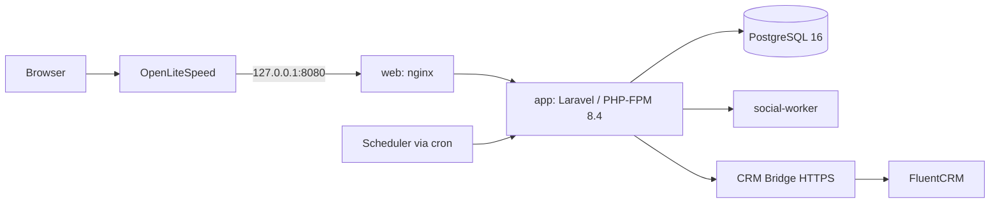
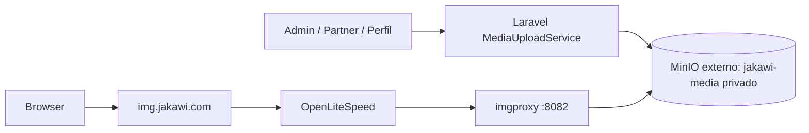

# Arquitectura actual

JAKAWI es un monolito Laravel 13 con frontend React/TypeScript servido mediante Inertia. La aplicación requiere PHP >= 8.4.1 dentro de Docker; PHP del host nunca debe usarse ni inspeccionarse para Laravel, Composer o tests.

```mermaid
flowchart LR
  B[Browser] --> OLS[OpenLiteSpeed]
  OLS -->|127.0.0.1:8080| W[web: nginx]
  W --> A[app: Laravel / PHP-FPM 8.4]
  A --> DB[(PostgreSQL 16)]
  A --> SW[social-worker]
  SC[Scheduler via cron] --> A
  A --> CB[CRM Bridge HTTPS]
  CB --> CRM[FluentCRM]
```

## Contenedores y borde

`compose.yaml` define `web`, `app`, `social-worker`, `db` e `imgproxy`. `web` publica solamente `127.0.0.1:8080:80`; OpenLiteSpeed maneja el HTTPS público de `jakawi.com` y hace proxy a ese puerto. `imgproxy` publica `127.0.0.1:8082:8080`; `img.jakawi.com` llega a él mediante OpenLiteSpeed. PostgreSQL no publica un puerto de host. Los datos de producción usan el volumen `jakawi_postgres_data` (con el proyecto Compose por defecto, normalmente `jakawicom_jakawi_postgres_data`).

El build Docker compila Vite una vez y copia el resultado tanto a la imagen `app` como a `web`. Por ello, cualquier cambio de frontend exige reconstruir/recrear ambos servicios en el mismo despliegue: mezclarlos deja manifests o chunks incompatibles.

## Aplicación y frontend consumidor

Las rutas públicas principales son `/`, `/explorar`, partners, lugares, beneficios y experiencias. Las rutas autenticadas incluyen `/mi-jakawi` y `/perfil`; el shell móvil canónico muestra Inicio, Explorar, Mi JAKAWI y Perfil. “Cerca” es una faceta de Explorar, no una navegación primaria.

Laravel entrega props Inertia y React renderiza las superficies consumidoras. La autenticación usa Laravel/Fortify; las áreas Partner y Admin están protegidas por middleware. Los componentes globales no deben asumir que existe un contexto de página Inertia.

## Backend, base de datos y roles

PostgreSQL 16 es la fuente transaccional. El dominio actual gira alrededor de `User`, `UserProfile`, `Partner`, `Location`, `Benefit`, `Membership`, `Redemption`, `Experience`, `ExperienceSession`, `ExperienceReservation` y `AnalyticsEvent`; la definición completa está en [DOMAIN.md](DOMAIN.md).

Un administrador se identifica por `users.is_admin`. El acceso Partner se concede explícitamente por el pivote `partner_user` con roles `owner`, `manager` o `staff`; ser admin no concede ese acceso automáticamente. No existe arquitectura runtime basada en Merchant ni `merchant_id`.

## Media privada

```mermaid
flowchart LR
  U[Admin / Partner / Perfil] --> L[Laravel MediaUploadService]
  L --> M[(MinIO externo: jakawi-media privado)]
  B[Browser] --> I[img.jakawi.com]
  I --> O[OpenLiteSpeed]
  O --> P[imgproxy :8082]
  P --> M
```

Laravel guarda object keys, no URLs completas. `MediaUrl` firma URLs de imgproxy y `JakawiImage` consume `src`/`srcset`; el navegador nunca recibe credenciales de MinIO. Véase [MEDIA.md](MEDIA.md).

## Aislamiento de tests

`./bin/jakawi-test` usa el proyecto `jakawi-test`, los servicios `app-test`/`db-test`, la base `jakawi_test` y el volumen `jakawi-test_jakawi_test_pgdata`. Antes de ejecutar comandos verifica `APP_ENV=testing`, `DB_HOST=db-test` y `DB_DATABASE=jakawi_test`. Producción no es un destino de pruebas destructivas.

Las ejecuciones de PHPUnit se serializan con un lock local y reconstruyen únicamente `jakawi_test` antes de migrar; una interrupción o una segunda invocación no comparte bootstrap de esquema. La arquitectura prevista para conversión/membresías está en [CONVERSION.md](CONVERSION.md).

La atribución reutiliza el visitor UUID first-party existente como identidad anónima y persiste contactos, referidos, settings y conversiones en PostgreSQL. La política y los límites de privacidad están en [ATTRIBUTION.md](ATTRIBUTION.md).

## Límite de pagos QR

`App\Payments\Qr\Contracts\QrPaymentGateway` es la única dependencia de una futura integración bancaria. La implementación actual es `DisabledQrPaymentGateway`; el contenedor puede resolver `FakeQrPaymentGateway` sólo fuera de producción para pruebas y desarrollo. El gateway crea pagos o informa estado canónico, pero nunca activa Membership ni recibe confirmación desde navegador. La futura aplicación confirmará una compra por una verificación confiable y reutilizará el pipeline de `MembershipPurchaseService`. Detalle y contrato: [PAYMENTS.md](PAYMENTS.md).
## Payout boundary

`RewardPayoutService` realiza la reserva, el pago y el rechazo dentro de transacciones con locks. El pago externo no se automatiza: la plataforma sólo registra su comprobante. `RewardTransaction` sigue siendo la fuente de verdad del ledger; analytics de payout es no bloqueante.

## Dominios y límites actuales

| Dominio | Responsabilidad |
| --- | --- |
| Benefits | Oferta de valor del Partner, disponibilidad, acceso y canje validado |
| Experiences | Actividad, tipo (incluye event), sesiones y destino externo de reserva pública en piloto |
| Unlocks | Demanda colectiva, compromisos, garantías JP, confirmación y fulfillment |
| Challenges | Evidencia, calificación, selección y recompensa diferenciadas |
| Membership | Solicitud, compra/grant, activación y vigencia |
| Cities | Contexto local, estados de ciudad, interés y aplicaciones |
| Discovery | Lectura agregada de oportunidades elegibles por ciudad y afinidad |
| Mi JAKAWI | Historial y valor del usuario, Membership, JP y participaciones |
| JP Ledger | RewardTransaction y holds; JP no es dinero |
| Campaigns | Reglas económicas administradas; no se activan con campaign_key |
| Attribution | Touch explícito y relación referral; mantiene historia |
| Growth Analytics | Eventos canónicos y contexto consultable de funnel; sin dashboard Growth dedicado |
| LandingPresentation | Presentación de adquisición de un subject existente |
| CRM projection | Outbox independiente y contacto/segmentación en FluentCRM |

**PRODUCT DETAIL** es la experiencia normal de navegación/operación. **MARKETING LANDING** es presentación para adquisición, lanzamiento, ads, QR, creators o email. Una landing nunca modifica verdad, economía o reglas del producto.

`/l/{slug}` presenta marketing; `/go/{slug}` sólo redirige a destinos externos configurados; `/d/{slug}` es la ruta nativa del Unlock. LandingPresentation resuelve el destino por viewer y scope sin reemplazar la identidad del producto.

`social-worker` usa `jakawi-app` para las colas `social-interactive,social`; no despacha CRM ni Meta. Ambos outboxes se despachan por scheduler cada minuto. WordPress/FluentCRM viven en CyberPanel, fuera de Docker.

Estado y límites: [CURRENT](CURRENT.md). Uso: [Manual de Funciones](product/MANUAL_DE_FUNCIONES.md). Carga comercial: [Manual de Inventario](operations/MANUAL_DE_INVENTARIO.md). Contratos: [Growth](growth-measurement-v1.md), [CRM](CRM_FOUNDATION_V1.md).

[Decisiones de arquitectura](decisions/README.md) · [Glosario](GLOSSARY.md). Scheduler es cron que invoca app, no un servicio Compose adicional; social-worker procesa colas sociales y CRM se despacha desde scheduler.
