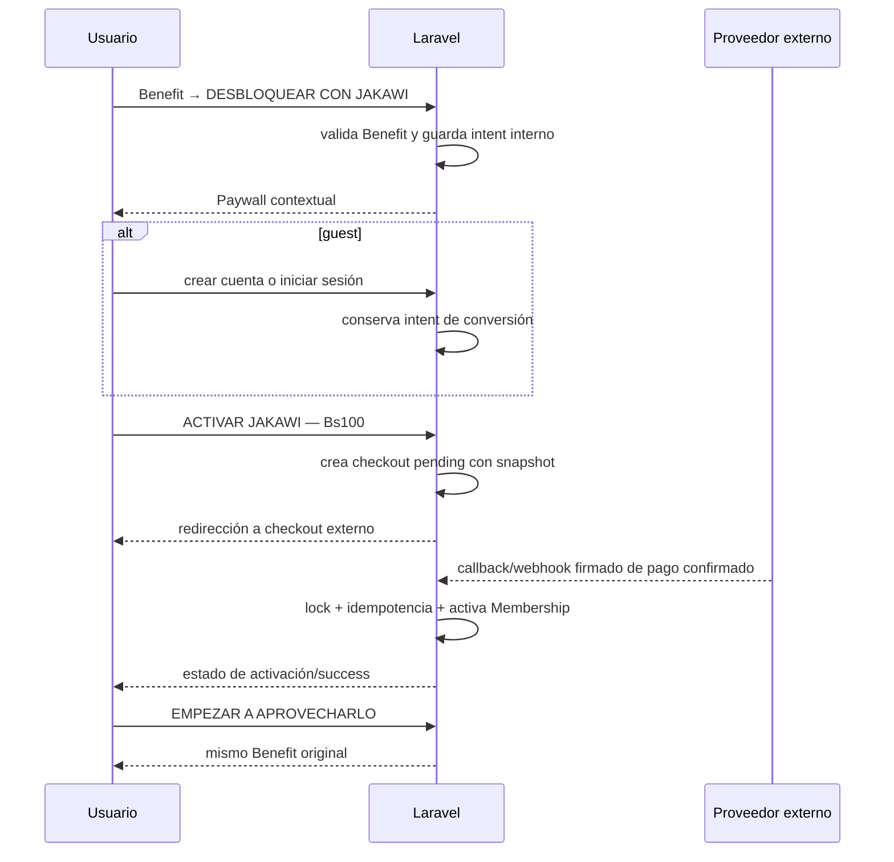

# Arquitectura de conversión MVP

## 1. Objetivo

Convertir el interés contextual en un Benefit en una membresía JAKAWI activa, sin convertir JAKAWI en una página SaaS de precios. La propuesta comercial vigente es **Bs100 por 365 días**. El pago será externo en el MVP, pero su confirmación y la activación siempre ocurren en el servidor.

Este documento define la siguiente implementación. No integra un proveedor, secretos, webhooks ni tablas todavía.

## 2. Auditoría de la implementación actual

| Área | Estado actual reutilizable | Gap de conversión |
| --- | --- | --- |
| Descubrimiento | Benefits y Partners son públicos; `PublicController::benefit` entrega Partner, ahorro estimado e imagen. | El CTA de un guest va directo a registro y pierde el Benefit que motivó la acción. |
| Beneficio | `benefits/show.tsx` muestra `DESBLOQUEAR CON JAKAWI`; un miembro activo ve `USAR BENEFICIO`. | No hay paywall contextual ni estado de miembro vencido. |
| Auth | Fortify crea y autentica usuarios; `LoginResponse` valida los `url.intended` de áreas protegidas. | Registro y login no conservan un intent de conversión de Benefit; el allowlist actual no admite Benefits públicos. |
| Mi JAKAWI | `MembershipController` y `mi-jakawi.tsx` ya muestran cuenta gratuita, miembro activo, valor y la configuración comercial. | El CTA de cuenta gratuita vuelve a Explorar, no inicia conversión. |
| Membresía | `Membership`, `User::activeMembership()` y `MembershipService` usan transacción y lock de usuario; precio/duración vienen de `config('jakawi.membership')`. | Sólo representa membresías activadas/canceladas. No modela intentos de checkout ni confirmaciones de proveedor. |
| Activación administrativa | Admin puede usar `MembershipService::activate` con método/referencia de pago. | No es una confirmación de checkout externo ni es idempotente por pago. |
| Analytics | `AnalyticsTracker` y `analytics_events` ya registran eventos first-party con contexto Benefit/Partner/usuario/visitante. | La taxonomía de conversión no está configurada; `AnalyticsTracker` sólo permite metadata explícitamente autorizada. |
| Redirecciones externas | Maps, WhatsApp y reservas externas usan `redirect()->away()` con destinos de contenido curado. | Checkout necesita retorno interno controlado, no una URL suministrada por navegador. |

No existe código de checkout, pago, webhook, `paid=true`, proveedor ni número Founder. El concepto **Acceso Fundador** no debe aparecer hasta que haya una regla comercial y datos reales que lo respalden.

La configuración canónica actual de la oferta está correctamente centralizada en `config/jakawi.php`, `membership.price_bob` y `membership.duration_days`; debe evolucionar ahí a un único producto/versionado, no dispersarse en componentes React.

## 3. Flujo canónico de conversión



El paywall siempre conserva el Benefit que provocó la conversión: título, Partner, ahorro estimado e imagen. No es una página genérica de pricing.

## 4. Flujo guest

1. El guest abre un Benefit público y pulsa `DESBLOQUEAR CON JAKAWI`.
2. Un endpoint interno valida que el Benefit está publicado/disponible, registra el intent server-side y muestra el paywall para ese Benefit.
3. El paywall ofrece `Crear cuenta gratis` y `Ingresar`.
4. Registro o login conservan el intent en sesión; al completar auth regresan al paywall, no a una URL de query string ni a Inicio.
5. Al iniciar checkout se crea el registro `pending`. Tras confirmación de servidor, success vuelve al mismo Benefit.

## 5. Flujo de usuario autenticado sin membresía

Un usuario gratuito sigue Benefit → unlock → paywall contextual → checkout. Si no hay un Benefit disparador (por ejemplo, llega desde Mi JAKAWI), el paywall puede usar un contexto de membresía sin Benefit, pero no debe fingir uno. En ese caso, success lleva a Mi JAKAWI; cuando hay Benefit, el retorno obligatorio es ese Benefit.

## 6. Comportamiento de miembro activo y vencido

- **Activo:** `User::hasActiveMembership()` ya decide correctamente por estado y fechas. El Benefit muestra únicamente `USAR BENEFICIO`; no hay paywall ni checkout.
- **Vencido:** una fila histórica cuyo `ends_at` pasó no es activa. Debe recibir el mismo paywall contextual con copy de renovación y crear un checkout de renovación. No se modifica retroactivamente la membresía anterior.
- **Cancelado:** se comporta como no activo; el copy puede ser de reactivación si producto lo requiere.

El modelo vigente no requiere un estado `expired`: la expiración se deriva de las fechas. Para renovación, tras pago confirmado se crea una nueva `Membership` que inicia al confirmar y conserva la anterior como historial. Un activo nunca puede abrir una segunda renovación con este MVP.

## 7. Contrato UX del paywall

El backend entrega un contrato explícito, no datos inventados por el cliente:

```ts
type ConversionPaywall = {
  triggerBenefit: {
    id: number; slug: string; title: string;
    partner: { name: string; slug: string };
    estimated_savings: string | null;
    image_url: string | null;
  } | null;
  membership: {
    product_code: string; price_bob: number; duration_days: number;
    benefits_copy: string[];
  };
  state: 'guest' | 'free' | 'expired';
  primary_cta: string; // ACTIVAR JAKAWI — Bs100
  can_create_account: boolean;
};
```

El paywall dice, cuando existe contexto, por ejemplo: “Burger Mania · 2×1 hamburguesas · Ahorras aproximadamente Bs45”. El CTA principal es `ACTIVAR JAKAWI — Bs100`; el secundario para guest es `Crear cuenta gratis`. No hay número Founder ni promesa distinta de datos reales.

La pantalla de éxito canónica es:

> ✓  
> **YA ERES JAKAWI.**  
> 365 días para vivir más tu ciudad.

Su primario `EMPEZAR A APROVECHARLO` retorna al Benefit original; el secundario `Ver mi JAKAWI` lleva a `/mi-jakawi`.

## 8. Estado de checkout/pago

`Membership` no basta para el MVP: no puede representar un checkout creado, fallo/cancelación, una referencia única de proveedor ni el procesamiento idempotente antes de activar. El MVP necesita una tabla dedicada, por ejemplo `membership_checkouts`, al integrar proveedor.

Campos mínimos:

| Campo | Propósito |
| --- | --- |
| `id`, `user_id` | checkout y comprador autenticado |
| `benefit_id` nullable | contexto de retorno validado; null sólo para conversión sin Benefit |
| `product_code`, `duration_days` | snapshot del producto comercial |
| `amount`, `currency` | snapshot monetario (`BOB`) |
| `provider`, `provider_reference` nullable | adaptador y referencia externa; índice único compuesto al existir referencia |
| `status` | `created`, `pending`, `paid`, `failed`, `cancelled`, `expired` |
| `membership_id` nullable | membresía creada al procesar el pago |
| `return_target` | target interno enumerado (`benefit` o `mi_jakawi`), nunca URL arbitraria |
| `idempotency_key`, `processed_at`, timestamps | deduplicación y auditoría mínima |

No hacen falta ahora facturas, impuestos, refunds, motor de suscripciones ni un ledger. El proveedor devuelve al usuario a una ruta interna de estado del checkout; esa ruta consulta el registro local y nunca decide que un pago fue exitoso por parámetros del navegador.

## 9. Confirmación server-side

La integración futura crea la sesión/orden externa desde Laravel y conserva los secretos sólo en backend. El browser puede iniciar checkout y volver, pero la transición a `paid` proviene exclusivamente de una API/callback del proveedor validada (firma, secreto, evento esperado y referencia).

El retorno del proveedor muestra uno de estos estados sin pantallas vacías:

| Estado local | UX |
| --- | --- |
| `created` / `pending` | `ESTAMOS ACTIVANDO TU JAKAWI...`; reconsulta el estado de forma segura. |
| `paid` y procesado | pantalla de éxito y los dos CTAs. |
| `failed` | “El pago no fue confirmado”; permite intentar otro checkout. |
| `cancelled` | retorno seguro al paywall, sin membresía. |
| `expired` / timeout | explica que venció y permite iniciar uno nuevo o reconsultar. |

Refresh es siempre una lectura del checkout; no crea otra membresía ni reenvía al proveedor automáticamente.

## 10. Activación de membresía

En una transacción de servidor:

1. Buscar el checkout por proveedor/referencia y hacer `lockForUpdate`.
2. Validar que la confirmación es auténtica y que importe, moneda y producto coinciden con el snapshot.
3. Si `processed_at` o `membership_id` existen, devolver el resultado ya persistido.
4. Bloquear el usuario; si ya tiene una membresía activa, no crear otra y resolver el checkout de forma auditada.
5. Crear la nueva `Membership` con fechas del snapshot, importe/referencia y fuente de sistema (el campo actual `activated_by` admite `null`).
6. Asociar `membership_id`, marcar checkout `paid`/`processed_at`, registrar `membership_purchased` y confirmar la transacción.

La actual `MembershipService::activate` es una base útil por su transacción y lock de usuario, pero debe recibir una vía específica `activateFromConfirmedCheckout`; no debe confiar en datos HTTP ni lanzar una segunda activación por un replay.

## 11. Estrategia de retorno al Benefit

No se aceptará `return`, `next` ni una URL completa desde el navegador. Al hacer unlock, Laravel guarda en sesión un intent estructurado, por ejemplo `{ benefit_id, return_target: 'benefit' }`, después de validar disponibilidad. Al crear el checkout, copia sólo ese contexto validado al registro de checkout.

Después de auth, una respuesta de registro/login de conversión lee el intent y redirige al paywall. Después de pago, success deriva la ruta mediante `benefit_id` y route model binding; si el Benefit dejó de estar disponible, usa `/mi-jakawi`. El allowlist existente de `LoginResponse` es útil para áreas protegidas, pero no se ampliará para aceptar URLs arbitrarias: el flujo de conversión usa su propia clave de sesión estructurada.

## 12. Idempotencia

- Un lock global del proveedor no sustituye locks de filas: callback, refresh y retry pueden coincidir.
- Una misma referencia externa se procesa una vez por índice único y `lockForUpdate`.
- El checkout conserva `membership_id` y `processed_at`; todos los replays devuelven ese resultado.
- Crear checkout usa una idempotency key server-side por usuario/producto/contexto para reutilizar un pending vigente en vez de duplicarlo.
- La activación bloquea usuario y checkout en la misma transacción; no activa dos membresías ni cobra/atribuye el evento dos veces.

## 13. Analytics

Se conserva la infraestructura `AnalyticsTracker`/`analytics_events` y los eventos de descubrimiento/valor actuales de [UX-MVP.md](UX-MVP.md): `home_view`, `partner_view`, `benefit_view`, `redeem_started`, `redeem_confirmed`, `experience_reserve_click`, además de los eventos de interacción vigentes.

La taxonomía única a añadir en la fase de conversión es:

| Evento | Momento | Contexto mínimo |
| --- | --- | --- |
| `benefit_unlock_clicked` | pulsa unlock en Benefit | benefit, partner, user/visitor |
| `membership_viewed` | se entrega paywall | benefit/partner si existe, user/visitor |
| `checkout_started` | checkout local creado/reutilizado y se redirige | benefit/partner, user |
| `membership_purchased` | transacción de activación confirmada | benefit/partner si existe, user |

La implementación añade esos nombres a `jakawi.analytics.events`, métodos explícitos a `AnalyticsTracker` y sólo metadata con allowlist. No guardar secretos, referencias del proveedor, importe sin necesidad ni PII adicional en analytics. `membership_purchased` se emite una vez junto con la activación idempotente.

## 14. Seguridad

- Ningún componente React puede activar `Membership`; sólo una confirmación validada en servidor lo hace.
- Un query string como `paid=true`, `status=success` o una redirección de navegador no cambia estado local.
- `return_target` es un enum interno y `benefit_id` se valida en servidor: no hay open redirect.
- Secretos y validación de firma del proveedor quedan en backend; el frontend sólo recibe URL/sesión pública necesaria.
- La referencia de proveedor, un índice único, locks y `processed_at` bloquean callbacks repetidos y activaciones duplicadas.
- La ruta de retorno no expone ni reejecuta callbacks; reconsulta estado autenticado del checkout perteneciente al usuario.

## 15. Estados de error

Auth incompleto conserva el intent mientras dure la sesión. Si el Benefit se despublica, el paywall/success informa que ya no está disponible y lleva a Explorar o Mi JAKAWI; nunca usa un slug no validado. Provider no disponible, callback inválido o importe no coincidente dejan el checkout pendiente/fallido para soporte y no activan membresía. Cancelación, timeout, refresh y pestañas duplicadas tienen los estados de la sección 9.

## 16. Componentes existentes que se reutilizan

- `PublicController::benefit`, `BenefitSummary` y `benefits/show.tsx` para trigger, detalle e imagen.
- `MembershipController`, `mi-jakawi.tsx` y `config('jakawi.membership')` para propuesta y estado de miembro.
- Fortify, `CreateNewUser` y `LoginResponse` para identidad, extendidos con continuidad de conversión segura.
- `Membership`, `User::activeMembership()` y la transacción de `MembershipService` para acceso y activación.
- `AnalyticsTracker` / `AnalyticsEvent` para eventos first-party.

## 17. Implementación faltante

Faltan rutas/controlador de unlock y paywall, almacenamiento server-side de intent, continuidad post-registro, contrato Inertia del paywall, checkout record, adaptador de proveedor, callback firmado, activación desde checkout, página de estado/success y eventos de conversión. No se requiere cambiar la navegación primaria ni rediseñar las pantallas existentes.

## 18. Secuencia de implementación

### Slice 1 — Paywall e intent de Benefit preservado

- **Backend:** ruta de unlock/paywall, validación de Benefit y session intent estructurado; exponer contrato contextual y producto desde config.
- **Frontend:** cambiar sólo los CTAs de Benefit hacia paywall contextual; estado activo sigue `USAR BENEFICIO`.
- **Tests:** guest/free/active/expired; intent no acepta URL externa ni Benefit no disponible.
- **Done:** el paywall muestra Benefit/Partner/ahorro reales y nunca pierde el contexto.

### Slice 2 — Continuidad registro/login

- **Backend:** respuestas post-login/post-registro que consumen el intent de conversión seguro y retornan al paywall; preservar verificación si aplica.
- **Frontend:** CTAs `Crear cuenta gratis` / `Ingresar` del paywall.
- **Tests:** guest registra, guest inicia sesión, redirect normal existente y rechazo de open redirect.
- **Done:** ambos caminos vuelven al mismo paywall contextual.

### Slice 3 — Checkout externo y registro local

- **Backend:** migración `membership_checkouts`, modelo, estados, snapshots y adaptador del proveedor; crear/reutilizar pending de forma idempotente.
- **Frontend:** CTA de checkout y pantalla pending/return sin éxito simulado.
- **Tests:** snapshots de producto, ownership, reintento y refresh seguro.
- **Done:** se puede iniciar checkout externo sin activar una membresía desde cliente.

### Slice 4 — Callback confirmado y activación idempotente

- **Backend:** endpoint/provider verifier, índice de referencia, locks, `activateFromConfirmedCheckout` y transición transaccional.
- **Frontend:** lectura de estado de checkout.
- **Tests:** firma válida/inválida, replay, callbacks concurrentes, renovación vencida y activo ya existente.
- **Done:** un pago confirmado crea exactamente una membresía y un replay no cambia el resultado.

### Slice 5 — Éxito y retorno al Benefit

- **Backend:** resolver retorno desde `benefit_id` validado, con fallback seguro a Mi JAKAWI.
- **Frontend:** pantalla `YA ERES JAKAWI`, CTA principal y secundario.
- **Tests:** success desde Benefit, sin contexto, Benefit ya no disponible, cancel/failure/timeout.
- **Done:** activación exitosa retorna al mismo Benefit cuando sigue disponible.

### Slice 6 — Analytics y estados operativos

- **Backend:** canonicalizar los cuatro eventos en config/tracker con metadata allowlist y emitirlos una vez.
- **Frontend:** mensajes de pending/failure/cancel/expired con retry o reconsulta.
- **Tests:** eventos, idempotencia del purchase y ausencia de referencias/secrets en analytics.
- **Done:** embudo medible sin eventos duplicados ni dead ends.
