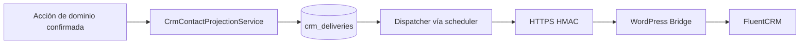

# CRM V1 — arquitectura, contrato y operación

**CURRENT / AUTHORITATIVE — 2026-10-09.** Para desarrollo y operaciones CRM. JAKAWI productivo de referencia: `e9d420870fa6d44802ceb52e4f253f84333b0071`; Bridge 1.0.1: `356fad2b51967c67a3a5efd62c91bffb758398c0`. Estado operativo de automations/cron conforme al contexto de producción suministrado; no es un nuevo ensayo ni una autorización de mutación.

## Responsabilidades

**JAKAWI → crm_deliveries → HTTPS firmado HMAC → Jakawi FluentCRM Bridge → FluentCRM.**

JAKAWI mantiene verdad de producto/dominio, AttributionTouch, ledger e historial analítico. FluentCRM recibe proyección de contactos para segmentación, email y automations; **no es un analytics warehouse**. `crm_deliveries` es independiente de `analytics_events` y `growth_provider_deliveries`.

CRM: https://crm.jakawi.com, WordPress + FluentCRM en runtime CyberPanel del host; no Docker. Bridge repo: `/home/crm.jakawi.com/public_html/wp-content/plugins/jakawi-fluentcrm-bridge`; [README del bridge](https://github.com/soyjavierquiroz/jakawi-fluentcrm-bridge/blob/main/README.md).

## Configuración y endpoint

Producción: **CRM_SYNC_ENABLED=true**, provider fluentcrm. Secret y URL se configuran externamente; no copiar credenciales a documentación. Enqueue/dispatch requieren flag, provider, URL HTTPS exacta y secret de al menos 32 bytes. Defaults del código no prueban por sí solos el estado de producción.

Endpoint actualmente usado: **https://crm.jakawi.com/?rest_route=/jakawi-fluentcrm/v1/events**. El servidor devuelve 404 para el routing pretty `/wp-json`; el fallback alcanza la misma ruta WordPress registrada `jakawi-fluentcrm/v1/events`.

También soportado por Laravel: **https://crm.jakawi.com/wp-json/jakawi-fluentcrm/v1/events**. Son las dos URLs exactas admitidas: sin hosts/puertos alternativos, userinfo, fragments, queries adicionales/duplicados ni variantes codificadas. No se siguen redirects. No confundir ruta plugin con forma de routing del host.

## Proyección y consentimiento

`CrmContactProjectionService` construye el contrato. Signup, aplicaciones Partner con email válido, aplicaciones de programa autenticadas, solicitud/activación/cambio de Membership, canje confirmado, reserva interna, participación Challenge, compromiso Unlock y cambios de perfil/preferencia producen proyección donde corresponde. No se envían page views/CTA, click IDs, fingerprint, metadata libre ni query strings.

Aplicación Partner sólo teléfono sigue válida sin delivery. Email comercial distinto del usuario se trata como contacto invitado. Aplicar no concede relación Partner: lista Partners/tag jakawi-partner requieren relación real del producto.

Single opt-in explícito; checkbox nuevo registro/Partner inicialmente marcado en UI, input ausente/desmarcado significa false. Eventos ordinarios UNCHANGED; cambios explícitos GRANT/REVOKE. Campo legado NULL no representa consentimiento. Bridge respeta suppressions unsubscribed/bounced/complained/spammed; no hay double opt-in ni enrollment retroactivo automático.

## Schema V1 — READY 3/15/32

CRM_SCHEMA_VERSION=1. READY significa mapping vivo compatible, no sólo counts guardados. Provision/repair requiere acción explícita de Admin en WordPress; activar plugin no aprovisiona schema de negocio.

Listas exactas:

- JAKAWI — Leads
- JAKAWI — Usuarios
- JAKAWI — Partners

Tags exactos:

- jakawi-lead
- jakawi-user
- partner-applicant
- program-applicant
- jakawi-partner
- membership-requested
- member-active
- member-expired
- benefit-redeemer
- experience-reserver
- challenge-participant
- unlock-participant
- source-meta
- source-tiktok
- source-google

32 custom fields agrupados; los nombres `last_*` representan LATEST:

| Grupo | Campos exactos |
| --- | --- |
| Identity / lifecycle (14) | jakawi_user_id, jakawi_city, jakawi_lifecycle_stage, membership_status, membership_started_at, membership_expires_at, lead_source, lead_form, signup_at, last_activity_type, last_activity_at, marketing_opt_in, marketing_opt_in_at, marketing_opt_in_source |
| FIRST attribution (9) | first_acquisition_provider, first_utm_source, first_utm_medium, first_utm_campaign, first_utm_content, first_utm_term, first_campaign_key, first_landing_slug, first_touch_at |
| LATEST attribution (9) | last_acquisition_provider, last_utm_source, last_utm_medium, last_utm_campaign, last_utm_content, last_utm_term, last_campaign_key, last_landing_slug, last_touch_at |

FIRST selecciona el touch más temprano con occurred_at ASC/id ASC y congela snapshot coherente completo, incluidos nulos. Nunca rellena huecos con otro touch. LATEST el más reciente con occurred_at DESC/id DESC y actualiza sólo por reloj más nuevo. Cada snapshot contiene provider, cinco UTMs, campaign_key, landing_slug y touch_at del mismo touch.

source-meta/source-tiktok/source-google derivan únicamente del FIRST congelado. NONE no crea source tag; cambiar LATEST no cambia fuente FIRST. `campaign_key` proviene de LandingPresentation, no URL arbitraria ni activación de Campaign económica.

Identity no usa el native user_id de FluentCRM. Resolver provider_contact_id, luego jakawi_user_id, luego email normalizado. IDs incompatibles o email ocupado devuelven conflicto, sin merge automático. Signup/lead surface son first-write; actividad conserva timestamp máximo y tipo asociado. Membership request añade requested; activación retira requested/expired y añade active; expiración retira active y añade expired. Cancelled/pending no se etiquetan como expired.

## Delivery contract y recuperación

Payload `encrypted:array` en reposo y oculto de serialización. Event UUID persistente; envelope V1 CONTACT_UPSERT con occurred_at/source/contact/identity/listas/tags/fields/marketing. Nunca contiene secret. Headers X-Jakawi-Timestamp, X-Jakawi-Event-Id y X-Jakawi-Signature; HMAC SHA256 sobre timestamp + newline + UUID + newline + raw body. Ventana ±300 segundos; máximo 65536 bytes. Misma UUID/body idempotente; misma UUID/body distinto conflicto 409.

Acciones de dominio confirman antes de callbacks de CRM; fallos de enqueue/HTTP **nunca revierten una acción de producto**. No hay HTTP síncrono de CRM en requests del dominio. `crm_contact_links` guarda vínculo durable provider/user/contact con restricciones únicas; email server-side oculto. Borrar User elimina su vínculo por cascada pero deliveries cifrados sin FK User conservan historia; no hay purge CRM automático.

Estados: **PENDING → PROCESSING → SENT / RETRY / DEAD**. `crm:dispatch` corre cada minuto, withoutOverlapping(15), máximo 100 filas/40 segundos. Lock PostgreSQL FOR UPDATE SKIP LOCKED durante request; caída revierte claim. Conexión default 3s/HTTP 8s, caps 5s/10s. No requiere worker/container adicional.

Retry por red, 429, 5xx: **1m, 5m, 15m, 1h, 6h; máximo seis intentos**. Retry-After acotado 1m–6h. Errores permanentes (incluidos 400/409/422/401/403) o presupuesto agotado → DEAD. Éxito requiere OK y provider_contact_id positivo antes del vínculo. Tras primer intento UUID/body fijos; timestamp y firma se renuevan.

Requeue explícito de una fila elegible, sólo con autorización operativa:

```bash
docker compose exec app php artisan crm:requeue <deliveryId>
```

Contrato del comando: **crm:requeue {deliveryId}**. Sólo DEAD/RETRY: cambia status a RETRY y next_attempt_at a ahora. Preserva **event_id, payload cifrado, source, attempts y historial de intento/creación**. No reinicia presupuesto, despacha ni habilita sync; rechaza inexistente/PENDING/PROCESSING/SENT. No reejecutar la acción comercial para reparar proyección.

## Automations actuales

| # | Nombre exacto | Estado |
| --- | --- | --- |
| 1 | JAKAWI — Lead → Usuario V1 | DRAFT / INACTIVE |
| 2 | JAKAWI — Onboarding Usuario V1 | DRAFT / INACTIVE |
| 3 | JAKAWI — Membresía Solicitada V1 | DRAFT / INACTIVE |
| 4 | JAKAWI — Onboarding Miembro V1 | DRAFT / INACTIVE |
| 5 | JAKAWI — Partner Applicant V1 | PUBLISHED / ACTIVE |

Partner Applicant: trigger tag **partner-applicant** añadido; **2 emails**, delay **2 días**, stop **jakawi-partner**. Publicar no enrola retroactivamente contactos. No incluir cuerpos de email, datos QA o contactos privados en repo. CRM sync activo no implica automations consumidor activas. Meta OFF en los tres flags; [Meta](../app/docs/meta-provider-v1.md).

## WordPress / FluentCRM cron runbook

Producción suministrada: page-load cron **DISABLE_WP_CRON=true**; **ALTERNATE_WP_CRON no habilitado**. Cron del servidor bajo usuario **crmja9127**, **cada minuto**, target **https://crm.jakawi.com/wp-cron.php?doing_wp_cron**, usando **flock + curl con timeout integrado** (`--connect-timeout 10 --max-time 50`); el wrapper actual no invoca el binario `timeout`. La entrada ejecuta `/home/crm.jakawi.com/bin/wordpress-cron` y registra en `/home/crm.jakawi.com/storage/logs/wordpress-cron.log`. Este es el cron WordPress; Laravel tiene scheduler independiente en [OPERATIONS](OPERATIONS.md).

Comprobaciones de operación (read-only, en ventana autorizada):

1. Revisar entrada efectiva de cron y resultados HTTP exitosos del target; sin ejecutar campañas como prueba.
2. Confirmar timestamps del scheduler FluentCRM avanzan entre observaciones.
3. Revisar locks y solapamientos: no borrar locks sin diagnosticar proceso y antigüedad.
4. Revisar email backlog/errores y que no aumente inesperadamente; no reenviar ni enrolar masivamente para comprobar cron.
5. Revisar counts/DEAD codes de Laravel y diagnostics de Bridge sin mostrar payload/PII/HMAC.

HTTP exitoso por sí solo no prueba procesamiento de email. No habilitar page-load/alternate cron como solución improvisada. No reinstalar la entrada ni publicar automations por seguir este documento.

## Fuentes y límites de consolidación

Contrato cotejado con modelos/servicios/config/comando/routes Laravel y `includes/Contract.php`, SchemaManager, EventStore y Adapter del bridge. Runtime CRM/automations y endpoint routing son estado operativo suministrado, no hechos deducidos del código. En esta tarea se verificaron de forma estática los booleanos accesibles (CRM sync y WordPress page-load cron), crontab del usuario y wrapper WordPress, sin imprimir configuración privada; no se ejecutó WordPress ni se consultaron contactos/automations.

Estado general: [CURRENT](CURRENT.md). Atribución/funnel: [Growth](growth-measurement-v1.md). Funciones: [manual](product/MANUAL_DE_FUNCIONES.md). Seguridad y diagnostics: [bridge README](https://github.com/soyjavierquiroz/jakawi-fluentcrm-bridge/blob/main/README.md).

[Registro histórico de implementación y validación](history/CRM_FOUNDATION_IMPLEMENTATION.md) retenido sin reclamar autoridad operativa actual.

## Flujo de proyección



Outbox y vínculo CRM son independientes del historial AnalyticsEvent. Recuperación por síntoma: [RUNBOOKS](operations/RUNBOOKS.md). Decisión: [ADR-003](decisions/ADR-003-fluentcrm-as-external-crm.md).
