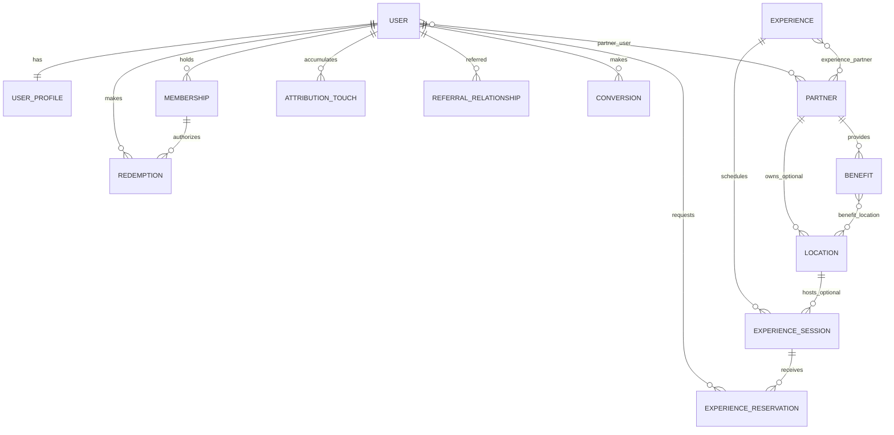

# Dominio

## Entidades y propiedad

- **User / UserProfile:** identidad del consumidor y perfil de intereses, ciudad, contexto social, días/horarios preferidos, apariencia y avatar.
- **Partner:** proveedor o creador de valor. Su equipo se asigna con `partner_user` (`owner`, `manager`, `staff`).
- **Location:** lugar físico donde ocurre algo. Puede pertenecer a un Partner o ser independiente; no es sinónimo de Partner.
- **Benefit:** oferta canjeable de un Partner. Puede aplicar a todas sus ubicaciones publicadas o a las seleccionadas mediante `benefit_location`; las ubicaciones independientes no son válidas para ese alcance.
- **Experience:** actividad descubrible. Puede asociarse a cero o más Partners mediante `experience_partner`, con rol editorial y orden.
- **ExperienceSession:** ocurrencia concreta de una Experience: fecha/hora, ubicación opcional y Partner responsable de reservas cuando corresponda.
- **ExperienceReservation:** solicitud interna de reserva de un miembro para una sesión. Se puede responder y registrar check-in; no es un dominio de booking, pago ni decremento de capacidad.
- **Membership:** acceso de consumidor. Está activa cuando su estado y rango de fechas lo permiten.
- **Redemption:** uso de un Benefit por un miembro con membresía activa; conserva snapshots operativos y de ahorro.
- **AnalyticsEvent:** eventos first-party limitados, vinculables a usuario y entidades de catálogo.
- **AttributionTouch / ReferralRelationship / Conversion:** evidencia de origen, primer referente válido y ventas idempotentes; véase [ATTRIBUTION.md](ATTRIBUTION.md).

## Ciclos y estados

Un Benefit debe estar publicado, disponible y ser elegible en una Location para iniciar un canje. El usuario confirma antes de crear el `Redemption`; los códigos pendientes tienen TTL de diez minutos y la confirmación es idempotente. Sólo los canjes confirmados cuentan para ahorro y ROI.

Una Experience publicada puede tener sesiones futuras. Una reserva es una solicitud interna por sesión: el Partner responsable puede confirmarla o rechazarla y luego registrar asistencia. La reserva no procesa dinero.

## Separación de responsabilidades

Admin administra y revisa contenido mediante `user.is_admin`. Partner accede solamente a los Partners que le asignó `partner_user`. El miembro consume catálogo, membresía, canjes y reservas. Estos roles no se deducen entre sí.

## Distinciones que no se deben diluir

Benefit equivale a valor canjeable; Experience equivale a actividad para descubrir y, si hay sesión, reservar. Partner es quien provee/crea; Location es el sitio físico. No reintroducir `merchant`, `merchant_id` ni la arquitectura legacy Merchant.
