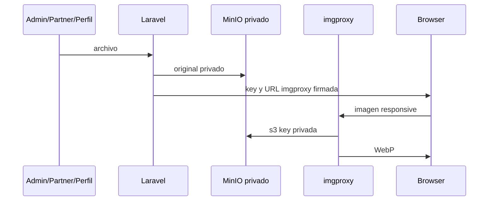

# Media

## Arquitectura

Los originales viven en el bucket privado externo MinIO `jakawi-media`, accesible por la API S3 `https://myminioback.kuruk.in`. Laravel usa el disco `minio-media`; las variables se llaman `MEDIA_AWS_ACCESS_KEY_ID`, `MEDIA_AWS_SECRET_ACCESS_KEY`, `MEDIA_AWS_DEFAULT_REGION`, `MEDIA_AWS_BUCKET`, `MEDIA_AWS_ENDPOINT` y `MEDIA_AWS_USE_PATH_STYLE_ENDPOINT`. imgproxy usa sus propias variables `IMGPROXY_AWS_ACCESS_KEY_ID`, `IMGPROXY_AWS_SECRET_ACCESS_KEY`, `IMGPROXY_KEY` e `IMGPROXY_SALT`. Nunca documentar ni compartir valores.

Las columnas guardan object keys, no URLs completas: `partners/{id}/...`, `benefits/{id}/...`, `experiences/{id}/...`, `locations/{id}/...` y `avatars/{user_id}/{uuid}.jpg`. `MediaUploadService` valida, almacena primero y elimina el objeto anterior sólo después del éxito. `MediaUrl` valida la key, construye una fuente S3 y firma la ruta; `JakawiImage` recibe `src` y `srcset`.

## Transformación y caché

imgproxy se sirve por `img.jakawi.com` → OpenLiteSpeed → `127.0.0.1:8082`; las URLs son firmadas y no se utiliza `/insecure/`. Las salidas son WebP. Los presets actuales son hero 1280×800, benefit card 640×480, experience card 720×480, partner cover 960×640, thumbnail 320×240 y avatar 256×256. El `srcset` usa anchos 320/480/640/960/1280 hasta el máximo del preset. imgproxy declara `public, max-age=31536000, immutable`; los object keys inmutables hacen seguro ese cacheo.

Como referencia de la migración, un hero PNG de 1774×887 y 2.349.286 bytes se redujo a WebP 1280×800 de 126.704 bytes; una card PNG de 1774×887 y 1.866.729 bytes a WebP 720×480 de 42.624 bytes.

Se aceptan JPEG, PNG y WebP, hasta 10 MB y 50.000.000 píxeles. SVG se rechaza para nuevas cargas. Los SVG locales legacy se conservan como comportamiento histórico/fallback, no son parte de las nuevas cargas MinIO. La migración ejecutada trasladó 59 objetos a MinIO, omitió intencionalmente 31 SVG locales y terminó con 0 fallos; los originales locales fueron preservados. El comando existente `php artisan jakawi:migrate-media-to-minio` hace dry-run por defecto; `--apply` persiste y debe usarse sólo con alcance y entorno verificados.

## Operación y advertencia crítica

El endpoint API S3 debe permanecer DNS-direct: no reintroducir Cloudflare proxy delante de `myminioback.kuruk.in`, pues altera la firma AWS SigV4 para imgproxy. La consola MinIO es `https://myminiofront.kuruk.in`; no es un endpoint público de media para el navegador.
