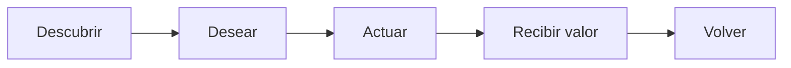

# Producto

JAKAWI es “la app para vivir más tu ciudad”. En Cochabamba, Bolivia, ayuda a descubrir lugares y experiencias, acceder a beneficios por ser miembro y tener nuevas razones para salir, probar y volver. Su promesa es: **Vive más. Gasta menos.**

## Posicionamiento

JAKAWI no es un marketplace de cupones, clon de Groupon, SaaS, banco, app crypto ni marketplace abierto. Cura Partners, Benefits y Experiences; la calidad de contenido, fotos y oferta es parte del producto.

La pregunta central de Inicio es “¿QUÉ HACEMOS HOY?”. Inicio combina saludo, búsqueda, categorías, hero dinámico y módulos de Benefits/Experiences según datos reales. Explorar (`/explorar`) mezcla Partners, Benefits y Experiences. Cerca vive dentro de Explorar.

## Membresía y valor

La propuesta comercial vigente es **Bs100 por 365 días**. La métrica norte es que el miembro reciba valor real. El concepto de payback es los días necesarios para recuperar Bs100; la interfaz puede decir “Te faltan Bs X…” y “Tu JAKAWI ya se pagó solo.” Sólo ahorros confirmados respaldan esa comunicación. El verde significa valor ya recibido, éxito, confirmación o payback: nunca ahorro estimado. En código, `Membership` conserva `amount_paid` y fechas por registro; el precio/duración no están fijados como constantes de modelo.

Mi JAKAWI es la pantalla de membresía/valor, no configuración. Perfil concentra identidad, avatar, ciudad, intereses, contexto social, preferencias de tiempo, apariencia y salida de sesión.

## Superficies consumidoras

La navegación canónica es Inicio, Explorar, Mi JAKAWI y Perfil. Un Benefit prioriza foto editorial, valor, condiciones, `USAR BENEFICIO`, confirmación previa, QR/código manual, TTL de 10 minutos y estado de éxito/ROI. Una Experience es cinematográfica e informa fecha, hora, lugar, descripción, organizador, precio y `RESERVAR`.

## Oferta y dirección

La estrategia de supply inicial es curada: Partners, Benefits y Experiences de alta calidad en Cochabamba. Ahora: pulido visual consumidor, calidad de fotos/contenido real, onboarding/calidad de supply y QA de lanzamiento. Después: refinamiento basado en uso real. Los conceptos diferidos están en [ROADMAP.md](ROADMAP.md).

Este documento define qué es JAKAWI. El funcionamiento canónico del MVP está en [UX-MVP.md](UX-MVP.md); su apariencia en [DESIGN-SYSTEM.md](DESIGN-SYSTEM.md), su modelo en [DOMAIN.md](DOMAIN.md) y su implementación en [ARCHITECTURE.md](ARCHITECTURE.md).
