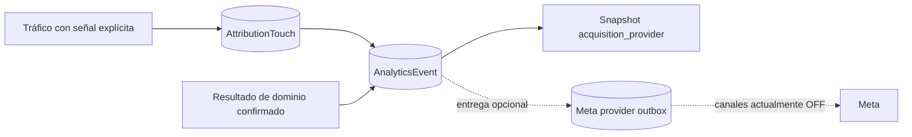

# Growth Measurement Foundation V1

Storage: `analytics_events`, extended in place. `GrowthMeasurementService` owns canonical context and idempotency. `AnalyticsTracker` remains the legacy primitive and delegates existing landing events to growth. The original foundation added no economic conversions. Current code includes canonical Growth Analytics storage/context and the implemented Meta provider foundation (disabled in production). No dedicated Growth Analytics reporting UI is established by current routes.

| Event | Stage | Authoritative trigger |
| --- | --- | --- |
| landing_view | ACQUISITION | Public LandingPresentation server render |
| landing_cta_click | INTENT | Shared delegated landing listener / existing public CTA endpoint |
| signup_completed | ACCOUNT | Fortify completes User creation and attribution association |
| membership_purchase_requested | MEMBERSHIP_INTENT | MembershipPurchaseRequest creation |
| membership_activated | MEMBERSHIP_CONVERSION | Membership creation or transition to active |
| benefit_redeemed | PRODUCT_CONVERSION | Redemption transitions to confirmed |
| experience_reserved | PRODUCT_CONVERSION | ExperienceReservation creation |
| challenge_joined | PRODUCT_CONVERSION | ChallengeParticipation creation |
| unlock_committed | PRODUCT_CONVERSION | UnlockParticipation creation/transition to COMMITTED |

All new analytics rows receive a persistent UUID `event_id`; existing rows receive UUIDs in the incremental migration. Server milestones use a unique `(event_name, source_type, source_id)` identity, preserving their event ID on retries. Historical events are not inferred into domain milestones. The stage is derived from the taxonomy, not stored.

The existing HTTP-only first-party UUID visitor cookie is retained across authentication. Events also carry `user_id` when available. Domain actions performed by administrators/partners use the beneficiary's touch identity, never the operator's visitor. No historical event merge is needed.

`AttributionTouch` remains the sole attribution source. Growth resolves applicable touches within the existing configured attribution window, ordered by `occurred_at DESC, id DESC`. LandingPresentation ID, slug, acquisition subject and default scope are stored as controlled touch metadata when the landing renders. Events snapshot the landing context, campaign key and five UTM fields. Membership activation uses an outstanding purchase request's frozen touch when applicable. Native traffic can have no landing or touch.

The outcome subject identifies the actual product/domain; the landing reference separately identifies acquisition. `campaign_key` is acquisition context only. Growth never resolves economic Campaign, records Conversion, or changes ConversionRecorder.

Domain model observers capture successful creation/status changes, then write after commit. Callback context and timestamps are captured before scheduling. Rollbacks discard callbacks. Writes use a separate transaction/savepoint and failures are best effort, with no PII-bearing exception messages in growth logs. Canonical analytics history stays in analytics_events; provider delivery now uses the separate growth_provider_deliveries outbox. CRM has its own independent crm_deliveries.

Views are server-side only; React hydration adds none. Admin previews, prefetch and Inertia partial reloads do not produce acquisition views/touches. The shared per-landing click listener records primary/secondary links and explicit participation buttons exactly once per click. Repeat clicks are valid. Preview/disabled controls are excluded. Tracking uses keepalive fetch, never awaits or delays navigation, and sends no form contents.

CTA metadata uses fixed kind/location categories. Query strings and fragments are stripped before transport. Stored internal destinations are route templates, with no sensitive route parameter values; external destinations are categorical. Growth context and metadata are allowlisted. No names, contact details, social post URLs, tokens, provider payloads, IP or User-Agent identities are stored. External WhatsApp intent cannot create an internal reservation milestone.

Meta mapping, browser Pixel and CAPI delivery/retries are implemented outside domain flows. Production channels remain OFF; see [Meta Provider V1](../app/docs/meta-provider-v1.md). No Purchase mapping exists.

Indexes reuse existing event/time, user/time and visitor/time indexes and add landing/time, campaign/time, attribution reference, unique event ID and unique outcome identity. Funnel queries can filter by landing, campaign key or scalar UTM fields without decoding metadata.

## Acquisition principles and membership

A touch is created only for an explicit acquisition signal: approved UTM, referral, recognized provider/click signal or configured landing campaign key. A direct render without signal creates no new touch and preserves the previous effective applicable touch within the configured window. Providers: **NONE, META, TIKTOK, GOOGLE**; provider classification is not economic reward eligibility or legal consent.

Canonical attribution fields: `utm_source`, `utm_medium`, `utm_campaign`, `utm_content`, `utm_term`, `campaign_key`, `landing_slug`. `campaign_key` is NOT arbitrary URL input: LandingPresentation owns it where configured. It does NOT activate an economic Campaign or change referral/reward rules. Keep acquisition subject separate from actual outcome subject.

https://jakawi.com/membresia accepts optional five standard UTMs as metadata only; they do not alter membership business intent. Arbitrary query strings are still rejected. `campaign_key` override is rejected; `acq` is not newly accepted by membership flow. Existing journey/action/resource/session context remains validated by the controller. Email links use `utm_source=fluentcrm&utm_medium=email`, provider **NONE**; email source is not fabricated as a paid provider.

## Current provider and reports

Meta Browser Pixel + CAPI foundation is implemented with `growth_provider_deliveries`. Production effective flags: META_PROVIDER_ENABLED=false, META_BROWSER_ENABLED=false, META_CAPI_ENABLED=false. No Purchase event. No enabling/backfill occurs merely by documenting this foundation.

High-level mappings: landing_view → ViewContent; landing_cta_click → JakawiLandingCTA; signup_completed → CompleteRegistration; membership_purchase_requested → Lead; membership_activated → JakawiMembershipActivated; benefit_redeemed → JakawiBenefitRedeemed; experience_reserved → JakawiExperienceReserved; challenge_joined → JakawiChallengeJoined; unlock_committed → JakawiUnlockCommitted.

Growth Analytics retains canonical funnel/history and indexed context suitable for queries by landing/campaign/UTM/provider. Current Admin exposes pilot/acquisition metrics and membership-request attribution, not a dedicated canonical Growth dashboard. FluentCRM is contact projection, not that history or reporting warehouse. Click on external reservation destination is intent, not experience_reserved. Provider failures never replace canonical facts or roll back product outcomes.

Authoritative implementation: GrowthMeasurementService, GrowthOutcomeObserver, AttributionService, AcquisitionProviderResolver and MetaEventMapper. Scope/current state: [CURRENT](CURRENT.md); economic attribution: [ATTRIBUTION](ATTRIBUTION.md); CRM projection: [CRM](CRM_FOUNDATION_V1.md); landing operations: [Manual de Inventario](operations/MANUAL_DE_INVENTARIO.md).

## Flujo de adquisición y medición

El snapshot se conserva en AnalyticsEvent; tráfico sin touch puede producir un evento con contexto nulo/NONE. No inferir que todo tráfico crea touch, ni que la clasificación habilita proveedor. Meta permanece OFF; este diagrama no activa envíos. [Glosario](GLOSSARY.md) · [ADR-005](decisions/ADR-005-acquisition-provider.md).
